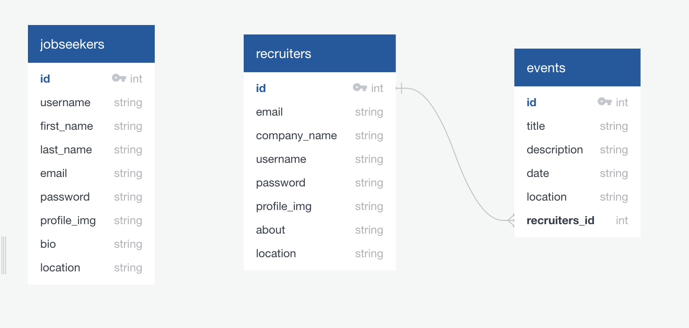
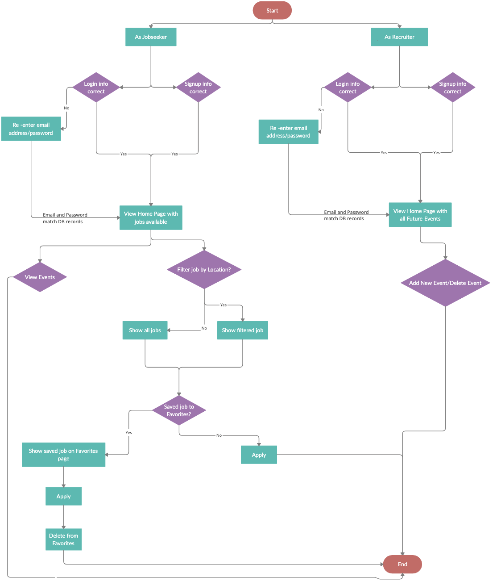
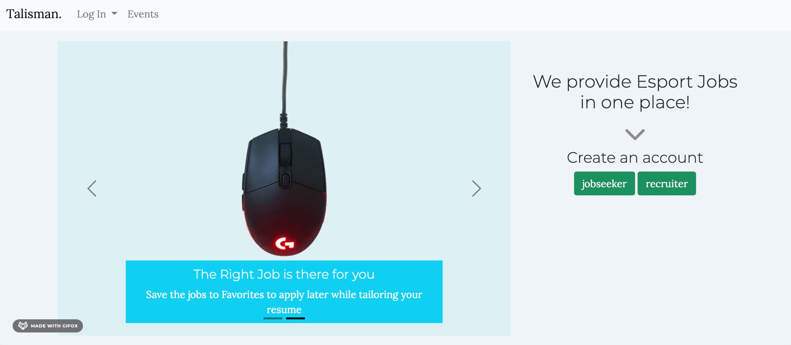
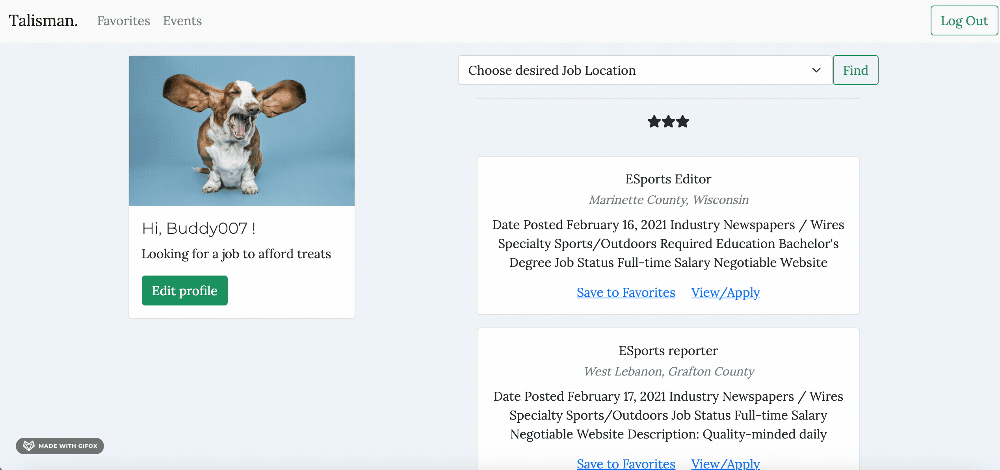
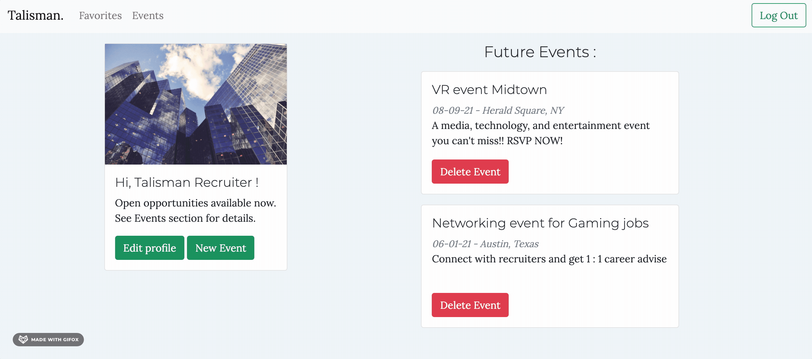

# Talisman Gaming Job Search App

Check it out on Heroku : [url here]

## Description

Talisman was created to connect Recruiters and Jobseekers in the Gaming industry with ease of use. Talisman strives to create a warm and welcoming environment with an easy way for users to browse through it. Jobseekers can apply for jobs, save them to favorites, browse open events and save them as well to RSVP later. Recruiters are able to create new events, and view all future events available. Teh idea is to connect recruiters to jobseekers by attending posted events and networking.

## Features

- access the website as a Jobseeker or a Recruiter, and discover different features
  for jobseekers:
- view upcoming events without signing up
- view available jobs on the home page
- save jobs to favorites to apply later
- apply from home page and get redirected to Adzuna website for more information about the job
- save events to favorites
  for recruiters:
- post new events
- delete posted events

## Installation

To install all libraries and dependencies, use:

```
pip install -r requirements.txt
```

## API Used

[Adzuna API](https://api.adzuna.com)

## Database Schema

*in works* connect Jobseekers to events db on star click



## User Flow






