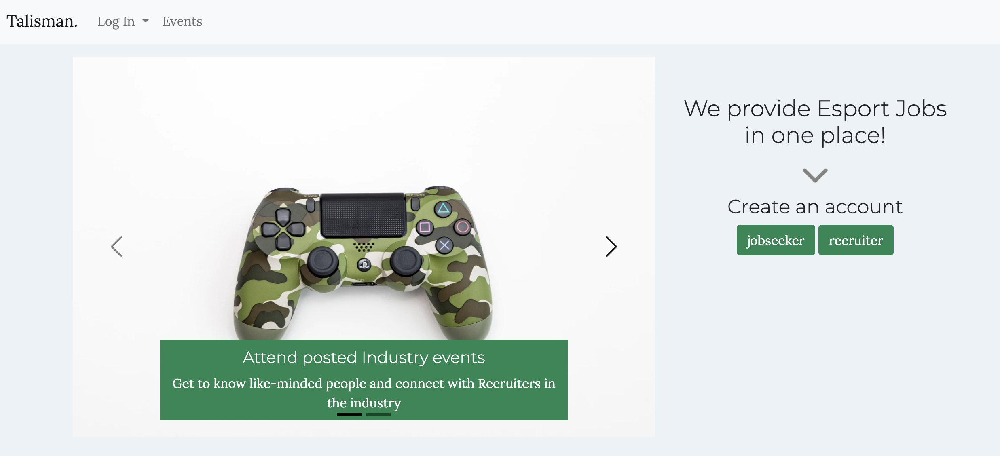
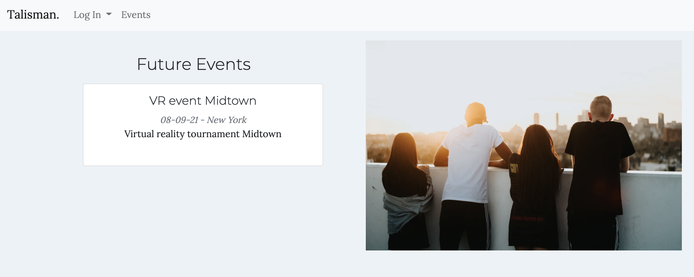

# Talisman Gaming Job Search App

Check it out on Heroku : [url here]

## Description

Talisman was created to connect Recruiters and Jobseekers in the Gaming industry with ease of use. Talisman strives to create a warm and welcoming environment with an easy way for users to browse through it, apply for jobs, save them to favorites etc. We want job seekers to connect to actual people by attending posted events and networking, and recruiters to be abele to post add events to the board.

## Features

- access the website as a Jobseeker or a Recruiter, and discover different features
- view upcoming events without signing up
- post new events
- view available jobs and filter them by location, save to favorites or apply

## Installation

To install all libraries and dependencies, use:
```
pip install -r requirements.txt
```

## API Used

[Adzuna API](https://api.adzuna.com)

## Database Schema


## User Flow

- choose a user path: Jobseeker or a Recruiter
- create profile with an ability of updating it later
- post networking events for jobseekers to see
- search for opportunities by filtering jobs in available locations
- save jobs to favorites if not ready to apply yet
- apply by following a link to Adzuna Job Search website



